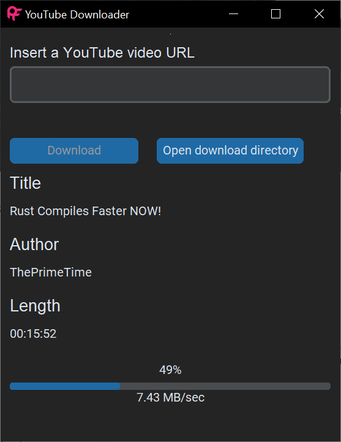
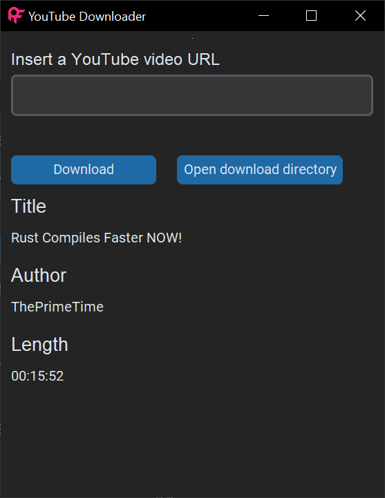
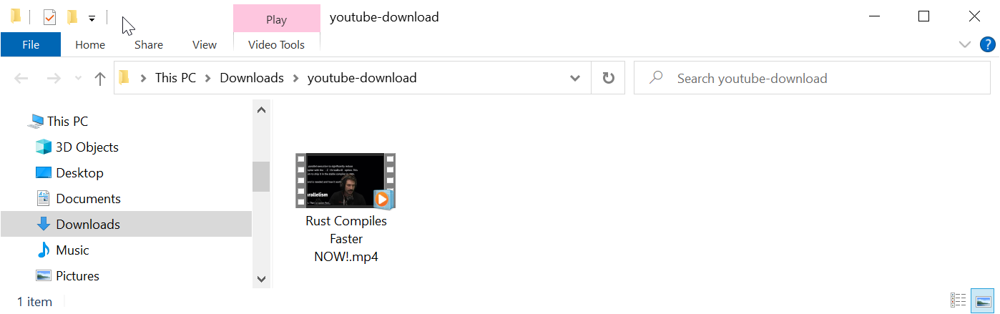

# Youtube downloader

Copy/paste a youtube video url in the GUI, click download!

Built with tkinter







## Run script

```python
python youtube-downloader.py
```

## Create standalone installer

```python
pyinstaller --onefile --windowed  youtube-downloader.py

pyinstaller --onefile --windowed --icon=favicon.ico youtube-downloader.py
```
